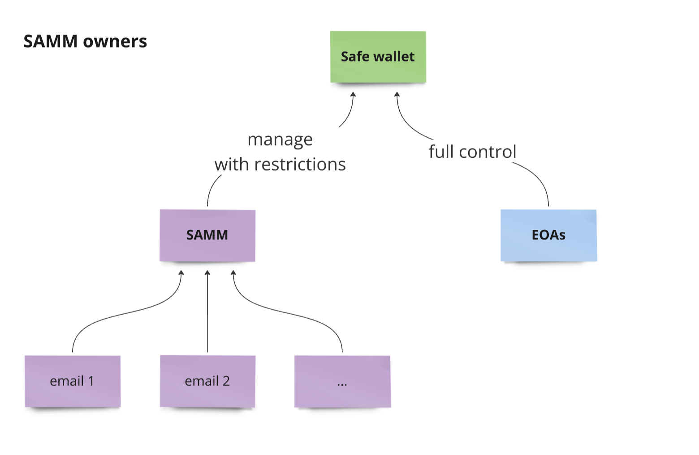
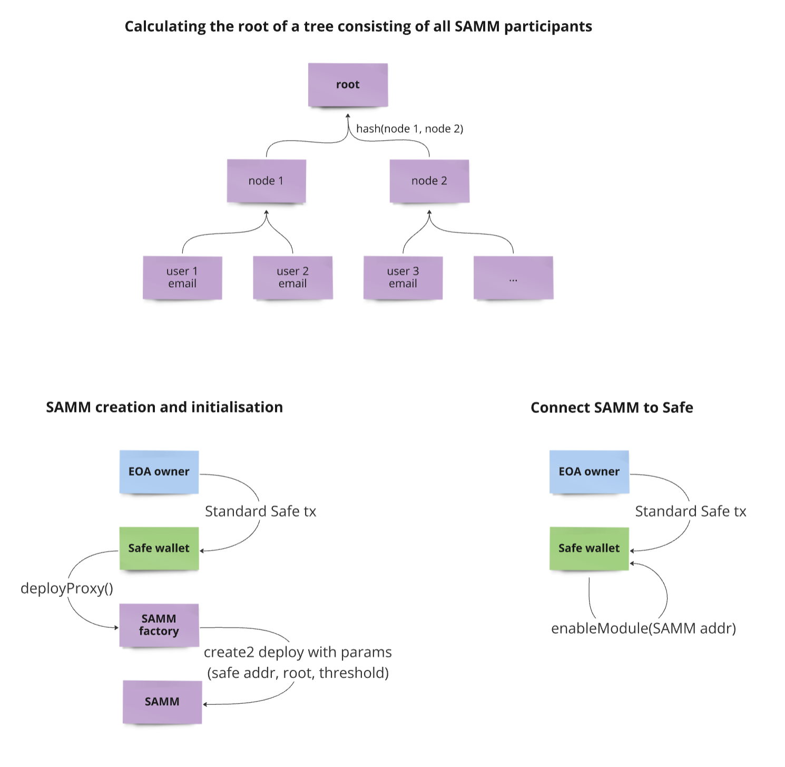
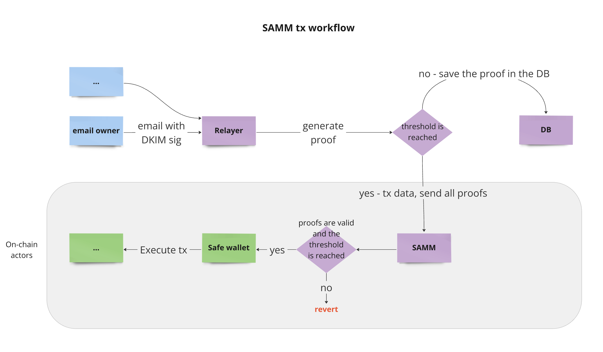

# Safe Anonymization Mail Module (SAMM)

## Description

Our key concept is the creation of a module for Safe multisig that ensures the anonymity of all its participants using Noir language and zkMail architecture.

The details are described in:

- [Proposal](https://github.com/orgs/noir-lang/discussions/5813#discussioncomment-10450949)

## Workflow

1. **Owners of Safe wallet**

   The multisig has a standard set of EOA owners who have full control over the multisig, including managing the rights of the SAMM module.

   The SAMM module has restrictions on what actions it can perform on behalf of the multisig (security policies). These restrictions are implemented and verified in the smart contract code. For example, the SAMM module cannot change the owners of the Safe multisig or can only call specific smart contracts. 
   
   Thus, the SAMM module is used to conveniently manage routine operations, while the standard set of EOA owners is used to handle critically important tasks.

   

2. **Connecting the Module to Safe**

   A Merkle tree is used to store the email addresses of the SAMM module owners.

   Our module incorporates a proxy pattern, deployed through the SAMM Factory.

   To link a module to Safe, Safe must invoke `enableModule`, passing the address of the created proxy as an argument.

   

3. **SAMM transaction execution**

   All SAMM owners send emails to the relayer's email address with the multisig transaction ID specified in the email header. Each email includes a DKIM signature.

   Upon receiving an email, the relayer generates zk proof that:
   - The sender's email address is SAMM module participant.
   - The recipient's email address is the relayer's address.
   - The email header contains the correct multisig transaction ID.
   - There is a DKIM signature verifying the validity of the email.
   
   Noir language is used for circuits. Circuits based on zkMail circuits and previous versions of SAM model circuits.

   A transaction can only be executed once the proof threshold is met.

   

## Timeline and Deliverables

1. **Planning and Setup** - 1 week

   Deliverables:
   - Setup of the development environment.
   - Finalized project requirements and technical specifications.

2. **Porting and Development** - 3 weeks
   
   Deliverables:
   - Conversion of Circom circuits to Noir (zkMail and SAM).
   - Development of the SAMM Module smart contract.

3. **Integration and Testing** - 2 weeks
   
   Deliverables:
   - A user interface for the module creation.
   - Implementation of the Relayer service.
   - A user interface for monitoring module activities.

4. **Deployment and Review** - 2 weeks
   
   Deliverables:
   - Deployment of all system components.
   - Completion of final documentation and user guides.
   - A comprehensive review of the project outcomes with recommendations for future improvements.